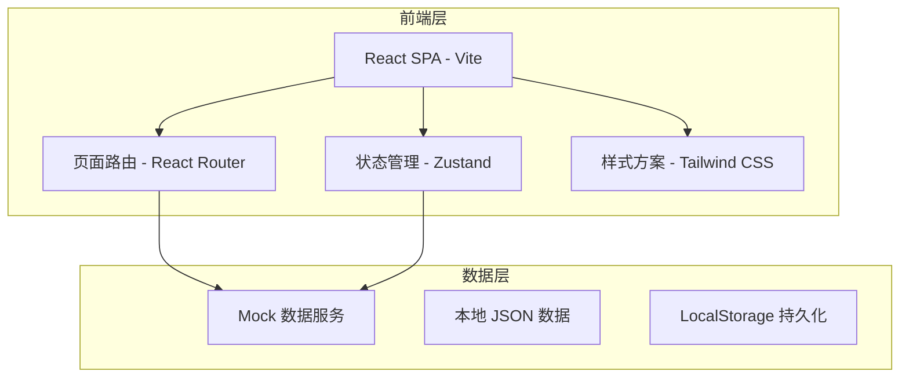
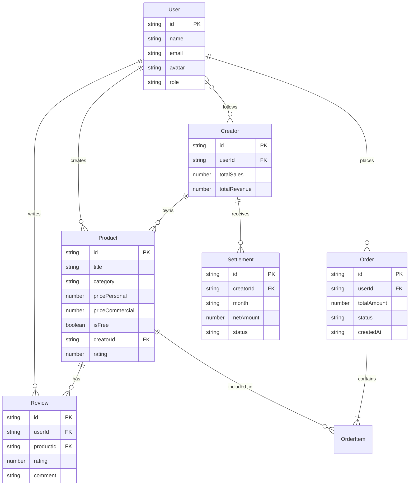

## 1. 架构设计



本项目为纯前端实现，使用 Mock 数据模拟后端接口，LocalStorage 模拟用户数据持久化。所有交易、结算、上传等流程通过前端状态管理模拟完成。

## 2. 技术说明

- **前端框架**：React@18 + TypeScript
- **构建工具**：Vite
- **样式方案**：Tailwind CSS@3
- **路由**：React Router DOM@6
- **状态管理**：Zustand
- **图表库**：Recharts（创作者后台数据可视化）
- **图标库**：Lucide React
- **动画库**：Framer Motion
- **初始化工具**：Vite + React + TypeScript 模板
- **后端**：无（纯前端 Mock）
- **数据库**：无（Mock JSON + LocalStorage）

## 3. 路由定义

| 路由 | 用途 |
|------|------|
| `/` | 首页 - Hero展示、分类导航、热门推荐、免费精选 |
| `/browse` | 浏览搜索页 - 关键词搜索、分类标签筛选、作品网格 |
| `/product/:id` | 作品详情页 - 预览轮播、购买、评分留言 |
| `/upload` | 上传发布页 - 作品信息填写、文件上传、价格授权设置 |
| `/dashboard` | 创作者后台 - 数据看板、作品管理、结算记录 |
| `/cart` | 购物车/结算页 - 订单确认、支付模拟 |
| `/purchases` | 我的购买 - 已购作品列表、下载凭证 |
| `/profile` | 个人中心 - 基本信息、关注列表 |

## 4. API 定义（Mock 接口）

### 4.1 作品相关

```typescript
interface Product {
  id: string
  title: string
  description: string
  category: Category
  tags: string[]
  creator: Creator
  pricePersonal: number
  priceCommercial: number
  isFree: boolean
  licenseTypes: LicenseType[]
  thumbnails: string[]
  previewImages: string[]
  fileFormat: string
  fileSize: string
  compatibility: string
  rating: number
  ratingCount: number
  downloadCount: number
  salesCount: number
  createdAt: string
  updatedAt: string
  status: ProductStatus
  reviews: Review[]
}

type Category = 'figma' | 'ppt' | 'font' | 'icon' | 'code' | 'notion' | 'other'
type LicenseType = 'personal' | 'commercial'
type ProductStatus = 'draft' | 'pending' | 'published' | 'offline'
```

### 4.2 创作者相关

```typescript
interface Creator {
  id: string
  name: string
  avatar: string
  bio: string
  followersCount: number
  productsCount: number
  totalSales: number
  totalRevenue: number
  joinedAt: string
}

interface CreatorDashboard {
  totalSales: number
  totalRevenue: number
  monthlyRevenue: number
  totalDownloads: number
  followersCount: number
  downloadTrend: TrendData[]
  salesByProduct: ProductSales[]
  settlements: Settlement[]
}

interface TrendData {
  date: string
  downloads: number
  sales: number
  revenue: number
}

interface ProductSales {
  productId: string
  title: string
  sales: number
  revenue: number
}

interface Settlement {
  month: string
  totalRevenue: number
  platformFee: number
  netAmount: number
  status: 'pending' | 'processing' | 'completed'
}
```

### 4.3 评价相关

```typescript
interface Review {
  id: string
  userId: string
  userName: string
  userAvatar: string
  rating: number
  comment: string
  createdAt: string
}
```

### 4.4 订单相关

```typescript
interface Order {
  id: string
  userId: string
  items: OrderItem[]
  totalAmount: number
  licenseType: LicenseType
  status: OrderStatus
  createdAt: string
  downloadCredential: string
}

interface OrderItem {
  productId: string
  title: string
  thumbnail: string
  price: number
  licenseType: LicenseType
}

type OrderStatus = 'pending' | 'paid' | 'completed' | 'refunded'
```

### 4.5 用户相关

```typescript
interface User {
  id: string
  name: string
  email: string
  avatar: string
  role: 'buyer' | 'creator'
  following: string[]
  purchases: string[]
  createdAt: string
}
```

## 5. 数据模型

### 5.1 数据模型定义



### 5.2 Mock 数据初始化

项目使用本地 JSON 文件提供 Mock 数据，包含：
- 20+ 件不同分类的作品数据
- 8 位创作者数据
- 30+ 条评价数据
- 6 条结算记录数据
- 下载趋势月度数据（12个月）
